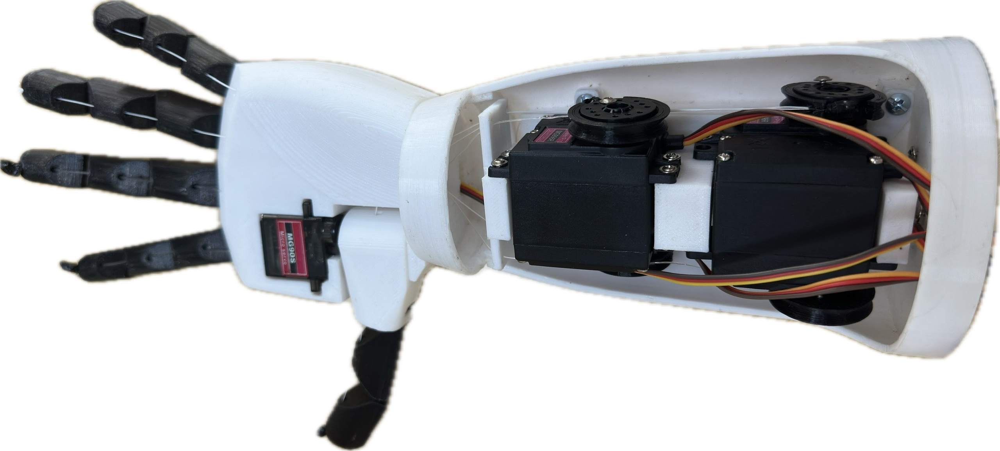
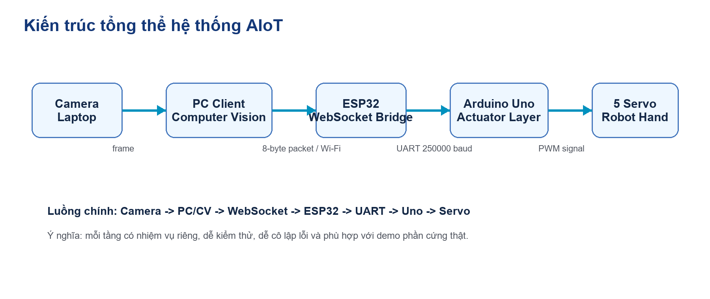
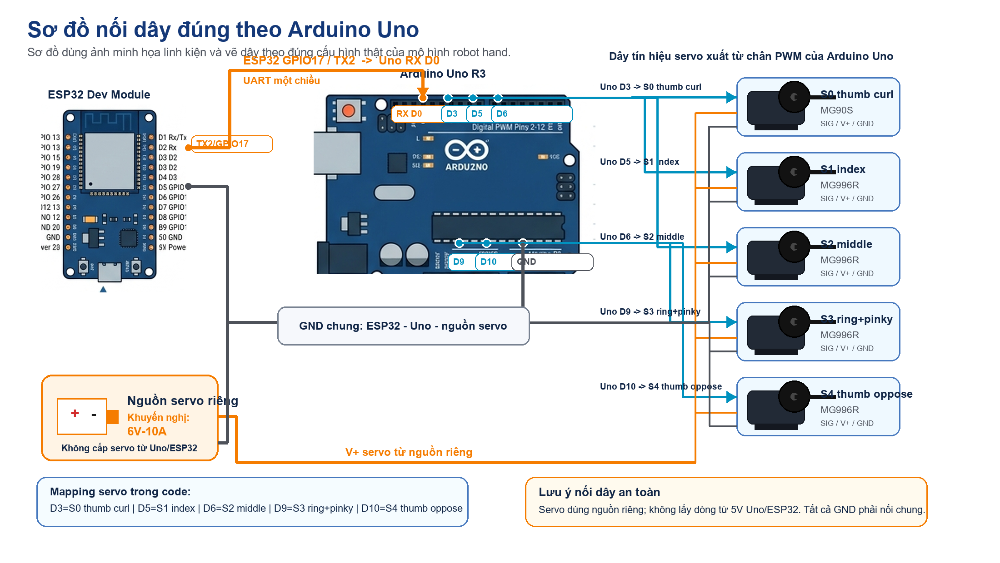
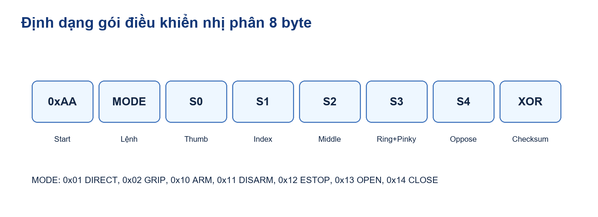
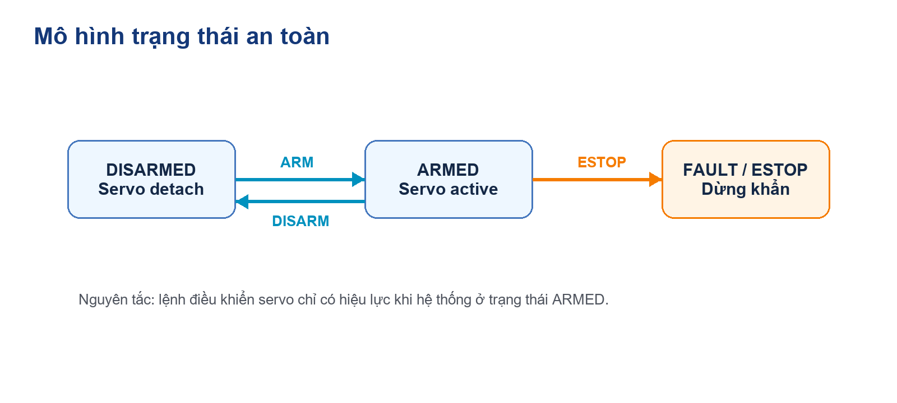
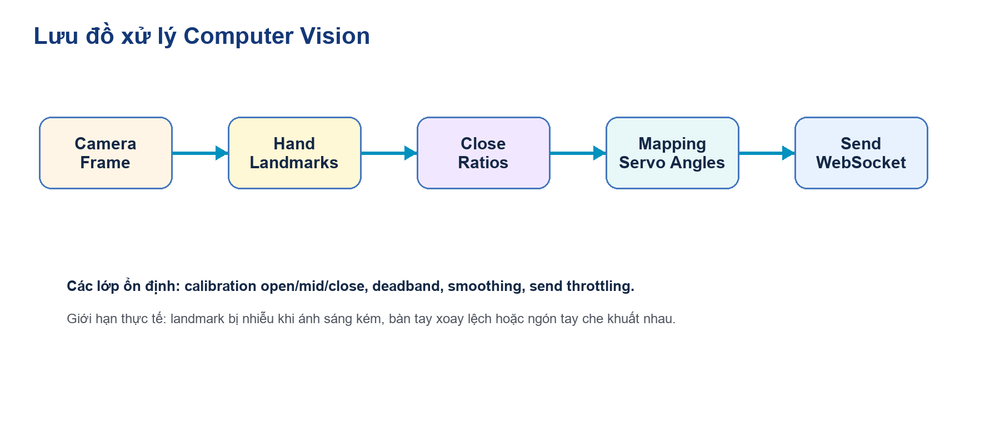
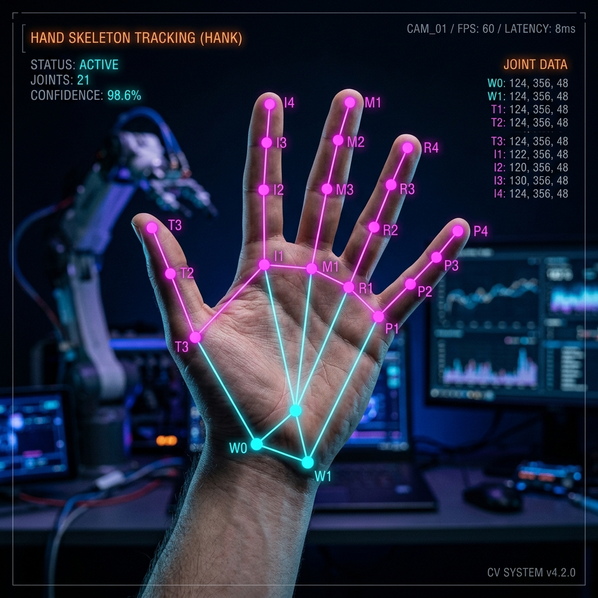
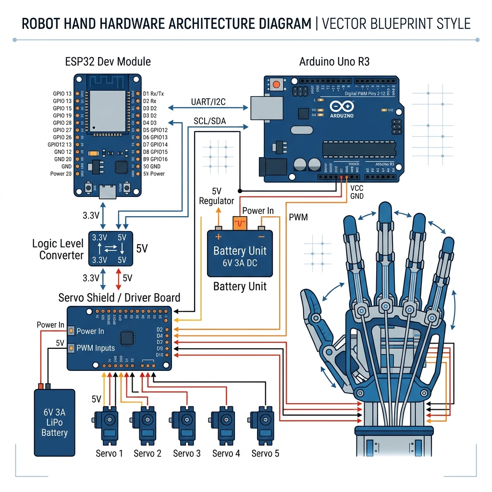

<div align="center">

# Vision-Driven Robot Hand

### From human hand motion to physical robot-hand motion in realtime

<p>
  
  
  
  
</p>

<p>
  
  
  
  
</p>

<p>
  <a href="web_poster/poster_full_vector.pdf">
    
  </a>
</p>

<p>
  <b>Camera sees.</b>
  <b>PC interprets.</b>
  <b>ESP32 relays.</b>
  <b>Arduino executes.</b>
  <b>Robot hand moves.</b>
</p>

</div>

## Why This Repo Feels Strong

Most student AI projects stop at detection.

Most hardware demos stop at manual control.

This project goes further and closes the full loop:

- sees a real human hand through camera input
- maps that motion into servo behavior
- sends compact realtime control packets
- bridges browser and PC control to embedded hardware
- moves a physical tendon-driven robot hand

That full-chain continuity is what gives the project real engineering weight.

## At A Glance

| Aspect | What makes it valuable |
| --- | --- |
| Real hardware | Controls actual servos, not simulation |
| AIoT pipeline | Vision -> transport -> embedded -> actuation |
| Multiple control modes | CV, dashboard, voice commands |
| Safety model | `ARM`, `DISARM`, `ESTOP`, preview-first workflow |
| Embedded protocol | Fixed 8-byte packet for deterministic transport |
| Demo readiness | Has a clear operator flow and test-first execution path |

## Poster And Demo Pack

| Official Poster | Dashboard Capture |
| --- | --- |
| [Open `poster_full_vector.pdf`](web_poster/poster_full_vector.pdf) |  |

The official poster is now shipped as a vector PDF for clean viewing and presentation quality.

- Poster source used for README: [`web_poster/poster_full_vector.pdf`](web_poster/poster_full_vector.pdf)
- Dashboard screenshot used for operator view: [`poster/dashboard_capture_hd.png`](poster/dashboard_capture_hd.png)

## Visual Preview

| Real Robot Hand | System Architecture |
| --- | --- |
|  |  |

These two visuals tell the whole story quickly:

- the left side proves this is a real physical build
- the right side explains how perception, transport, and actuation connect end to end

## Technical Gallery

| Hardware Wiring | Packet Format |
| --- | --- |
|  |  |

| Safety State Machine | CV Algorithm |
| --- | --- |
|  |  |

| Skeleton Preview | Hardware Reference |
| --- | --- |
|  |  |

This turns the README from a plain description into a compact technical exhibit:

- architecture for system thinking
- wiring for hardware trust
- packet format for embedded credibility
- state machine for safety logic
- CV visuals for perception depth

## Core Experience

```text
Your hand moves
-> the camera captures it
-> the PC interprets it
-> the ESP32 relays it
-> the Arduino executes it
-> the robot hand responds
```

That immediate cause-and-effect is the heart of the demo.

## Full Live Pipeline

```text
Camera / Voice / Dashboard
-> PC client or browser UI
-> Binary packet (8 bytes)
-> ESP32 WebSocket bridge
-> UART2 TX2 GPIO17
-> Arduino Uno RX D0
-> 5-servo tendon-driven robot hand
```

## Table Of Contents

- [Vietnamese](#vietnamese)
- [English](#english)
- [Project Assets](#project-assets)
- [License](#license)

---

## Vietnamese

### Tổng quan

`Vision-Driven Robot Hand` là dự án AIoT điều khiển bàn tay robot 5 bậc tự do theo thời gian thực, trong đó chuyển động bàn tay người được camera ghi nhận, xử lý trên PC, chuyển thành gói lệnh nhị phân, truyền qua ESP32 và thực thi trên Arduino Uno để điều khiển cụm servo thật.

Poster chính thức của dự án hiện được dùng dưới dạng vector PDF:

- [`web_poster/poster_full_vector.pdf`](web_poster/poster_full_vector.pdf)

Điểm mạnh của dự án không nằm ở việc nhận diện cho đẹp, mà ở chỗ toàn bộ pipeline đã đi tới phần cứng thật:

- cảm nhận bằng Computer Vision
- điều khiển bằng dashboard web và voice command
- truyền lệnh realtime bằng WebSocket và UART
- bridge nhúng bằng ESP32
- chấp hành cuối bằng Arduino Uno và cụm servo

### Vì sao dự án này đáng giá

| Hạng mục | Ý nghĩa |
| --- | --- |
| Real hardware control | Robot tay thật chuyển động theo lệnh thật |
| AI triển khai tới actuator | Không dừng ở model hay preview camera |
| Kiến trúc nhiều lớp | Dễ tách bạch để test, debug và demo |
| Workflow an toàn | Có `ARM`, `DISARM`, `ESTOP`, link test, preview trước khi chạy thật |
| Protocol gọn | Packet 8 byte phù hợp với embedded realtime control |
| Giá trị portfolio cao | Thể hiện tốt năng lực AI ứng dụng, embedded và systems integration |

### Tính năng hiện có

| Thành phần | Khả năng hiện tại |
| --- | --- |
| Robot hand | `OPEN`, `CLOSE`, `GRIP`, direct servo angles, hold pose |
| Computer vision | Theo dõi hand skeleton, calibration, preview, realtime send |
| Web dashboard | Connect, ARM/DISARM, grip slider, direct servo sliders, camera preview |
| Voice control | Lệnh cơ bản như open hand, close hand, arm, disarm, estop |
| Debugging | Link test, packet test, protocol reference, hardware checklist |

### Gallery kỹ thuật

| Mô hình thật | Dashboard |
| --- | --- |
|  |  |

| Kiến trúc hệ thống | Wiring phần cứng |
| --- | --- |
|  |  |

| State machine an toàn | CV skeleton |
| --- | --- |
|  |  |

Các hình này giúp README có chiều sâu hơn ở cả ba lớp:

- lớp hệ thống: kiến trúc, wiring, protocol
- lớp vận hành: dashboard, mode điều khiển, safety
- lớp AI: skeleton tracking và pipeline xử lý

### Bản sắc kỹ thuật của hệ thống

Dự án này có chất vì nó tôn trọng đúng bản chất của phần cứng thật:

- truyền thông có thể lỗi
- nguồn có thể sụt
- servo có thể rung hoặc giật
- calibration có thể lệch
- browser không phải lúc nào cũng là lớp điều khiển cuối đáng tin cậy

Vì vậy hệ thống được xây với tư duy an toàn ngay từ đầu:

- `ARM`
- `DISARM`
- `ESTOP`
- preview trước khi chạy live
- link test trước khi đổ lỗi cho CV
- calibration cố định giữa các tầng

### Tech Stack

<p>
  
</p>

Các công nghệ và thành phần chính:

- Python client cho CV, calibration và protocol test
- HTML dashboard + local Python bridge server
- ESP32 làm WebSocket bridge
- Arduino Uno điều khiển 5 servo tendon-driven
- Giao thức binary 8 byte cho realtime control

### Kiến trúc hệ thống

#### 1. Computer Vision Layer

- Đọc camera và theo dõi bàn tay người
- Chuyển pose thành góc servo
- Preview an toàn trước khi gửi lệnh thật
- Gửi packet realtime khi hệ thống sẵn sàng

File chính:

- [`pc_client/cv_sender_template.py`](pc_client/cv_sender_template.py)

#### 2. Web Control Layer

- Dashboard điều khiển trực tiếp
- `ARM`, `DISARM`, `ESTOP`
- `OPEN`, `CLOSE`, `GRIP`
- Direct control từng servo
- Camera preview và browser-safe bridge

File chính:

- [`web_client/master_control.html`](web_client/master_control.html)
- [`web_client/master_control_server.py`](web_client/master_control_server.py)

#### 3. ESP32 Bridge Layer

- Tạo AP `RobotHand_ESP32`
- Host WebSocket server ở port `81`
- Kiểm tra `start byte` và `checksum`
- Forward packet sang Uno qua `Serial2`

Firmware:

- [`firmware/esp32_ws_bridge/esp32_robot_hand_ws_bridge/esp32_robot_hand_ws_bridge.ino`](firmware/esp32_ws_bridge/esp32_robot_hand_ws_bridge/esp32_robot_hand_ws_bridge.ino)

#### 4. Actuator Layer

- Nhận packet 8 byte từ ESP32
- Quản lý `DISARMED`, `ARMED`, `ESTOP`
- Thực thi `OPEN`, `CLOSE`, `GRIP`, `DIRECT`
- Điều khiển 5 servo theo calibration cố định

Firmware:

- [`firmware/arduino_uno/robot_hand_uno_realtime_final/robot_hand_uno_realtime_final.ino`](firmware/arduino_uno/robot_hand_uno_realtime_final/robot_hand_uno_realtime_final.ino)

### Phần cứng

#### Linh kiện

- 1 ESP32
- 1 Arduino Uno
- 1 MG90S
- 4 MG996R
- 1 nguồn servo riêng `5V-6V`

#### Servo mapping

```text
S0 thumb curl    -> Uno D3
S1 index         -> Uno D5
S2 middle        -> Uno D6
S3 ring+pinky    -> Uno D9
S4 thumb oppose  -> Uno D10
```

#### UART wiring

```text
ESP32 GPIO17 / TX2 -> Uno RX D0
ESP32 GND          -> Uno GND
```

Hệ thống đang dùng cấu hình truyền một chiều từ ESP32 sang Uno.

#### Quy tắc cấp nguồn servo

- Dùng nguồn servo riêng
- Không cấp cả cụm servo từ chân `5V` của Uno hoặc ESP32
- Khuyến nghị tối thiểu `6V 10A`
- Nối chung tất cả GND: servo PSU, Uno, ESP32

Tài liệu liên quan:

- [`HARDWARE_CHECKLIST.md`](HARDWARE_CHECKLIST.md)
- [`docs/wiring.md`](docs/wiring.md)

### Locked Calibration

```text
OPEN  = {40, 180, 0,   0,   80}
CLOSE = {170, 0,   180, 180, 0}
```

Đây là calibration bắt buộc phải đồng bộ giữa firmware, PC client và dashboard.

Tài liệu liên quan:

- [`docs/calibration.md`](docs/calibration.md)
- [`pc_client/hand_pose_calibration.json`](pc_client/hand_pose_calibration.json)
- [`pc_client/servo_tendon_profile.json`](pc_client/servo_tendon_profile.json)

### Khởi động nhanh

#### 1. Cài môi trường Python

```powershell
.\setup_python_env.bat
```

#### 2. Nạp firmware

- Uno: [`firmware/arduino_uno/robot_hand_uno_realtime_final/robot_hand_uno_realtime_final.ino`](firmware/arduino_uno/robot_hand_uno_realtime_final/robot_hand_uno_realtime_final.ino)
- ESP32: [`firmware/esp32_ws_bridge/esp32_robot_hand_ws_bridge/esp32_robot_hand_ws_bridge.ino`](firmware/esp32_ws_bridge/esp32_robot_hand_ws_bridge/esp32_robot_hand_ws_bridge.ino)

Nếu upload Uno lỗi sync, rút dây `ESP32 TX2 -> Uno RX D0`, upload xong cắm lại.

#### 3. Kết nối Wi-Fi ESP32

```text
SSID: RobotHand_ESP32
Pass: 12345678
IP:   192.168.4.1
WS:   ws://192.168.4.1:81
```

#### 4. Chạy link test trước

```powershell
.\run_link_test.bat
```

#### 5. Chạy mode cần dùng

```powershell
.\run_master_control.bat
.\run_preview_cv.bat
.\run_realtime_cv.bat
```

### Các chế độ vận hành

#### Master Control Dashboard

Đây là mode đầy đủ nhất để demo và vận hành thực tế.

- Web control panel
- `ARM` / `DISARM` / `ESTOP`
- Grip presets và servo sliders
- Voice command panel
- Camera preview realtime

```powershell
.\run_master_control.bat
```

Workflow gợi ý:

```text
Connect -> ARM -> OPEN/CLOSE/GRIP -> DIRECT CONTROL
```

#### CV Preview Only

Mode an toàn để kiểm tra landmark và mapping mà không tác động lên phần cứng.

```powershell
.\run_preview_cv.bat
```

#### CV Realtime Control

Chỉ chạy khi link test đã pass và phần cứng đã sẵn sàng.

```powershell
.\run_realtime_cv.bat
```

#### Link Test

```powershell
.\run_link_test.bat
```

Nó kiểm tra trực tiếp tuyến:

```text
PC -> WebSocket -> ESP32 -> UART -> Uno
```

### Giao thức truyền thông

Realtime control sử dụng packet nhị phân cố định `8 byte`.

```text
Byte 0: 0xAA
Byte 1: mode
Byte 2..6: payload
Byte 7: XOR checksum của byte 0..6
```

Modes:

```text
0x01 = direct angles
0x02 = grip percent
0x10 = ARM
0x11 = DISARM
0x12 = ESTOP
0x13 = OPEN
0x14 = CLOSE
```

Chi tiết thêm:

- [`docs/protocol.md`](docs/protocol.md)
- [`tools/make_packet_reference.py`](tools/make_packet_reference.py)

### Trình tự demo nên dùng

1. Giới thiệu phần cứng và quy tắc cấp nguồn.
2. Giải thích pipeline `PC -> ESP32 -> Uno -> Servo`.
3. Chạy `link test`.
4. Mở dashboard và điều khiển trực tiếp từng servo.
5. Chạy `CV preview`.
6. Chạy `CV realtime`.
7. Kết thúc bằng grip presets hoặc voice command.

Đây là trình tự giúp người xem đi từ niềm tin kỹ thuật sang ấn tượng trực quan.

### Quy trình an toàn

1. Kiểm tra nguồn và GND chung.
2. Xác nhận wiring.
3. Chạy `link test`.
4. Mở dashboard và `ARM` khi sẵn sàng.
5. Test `OPEN`, `CLOSE`, `GRIP` trước.
6. Chỉ chạy `CV realtime` khi đường truyền đã ổn định.
7. Sử dụng `DISARM` hoặc `ESTOP` nếu có bất thường.

Trạng thái chính:

- `DISARMED`
- `ARMED`
- `ESTOP`

### Cấu trúc dự án

```text
robot_hand_realtime/
|-- firmware/
|-- pc_client/
|-- web_client/
|-- docs/
|-- scripts/
|-- tools/
|-- poster/
|-- QUICKSTART.md
|-- HANDOVER.md
|-- HARDWARE_CHECKLIST.md
|-- KNOWN_ISSUES.md
`-- README.md
```

### File quan trọng

| File | Vai trò |
| --- | --- |
| [`QUICKSTART.md`](QUICKSTART.md) | Cách chạy nhanh nhất cho người mới |
| [`HANDOVER.md`](HANDOVER.md) | Bàn giao ngắn gọn cho demo/operator |
| [`HARDWARE_CHECKLIST.md`](HARDWARE_CHECKLIST.md) | Checklist nguồn, dây, upload firmware |
| [`KNOWN_ISSUES.md`](KNOWN_ISSUES.md) | Các tình huống lỗi đã gặp |
| [`docs/protocol.md`](docs/protocol.md) | Mô tả giao thức 8 byte |
| [`docs/calibration.md`](docs/calibration.md) | Ghi chú calibration |
| [`docs/realtime_notes.md`](docs/realtime_notes.md) | Ghi chú tuning realtime |

### Verification và Release

```powershell
powershell -ExecutionPolicy Bypass -File .\scripts\verify_project.ps1
powershell -ExecutionPolicy Bypass -File .\scripts\build_release.ps1
```

### Giới hạn hiện tại

- CV phụ thuộc ánh sáng, góc tay và camera
- Cơ cấu tendon-driven cần calibration kỹ
- Độ mượt và grip force bị ảnh hưởng bởi nguồn và cơ khí
- Dashboard browser hiện vẫn phụ thuộc Python bridge để giao tiếp ổn định với ESP32

### Kết luận ngắn

Đây là kiểu dự án nhìn đẹp trên portfolio, nhưng quan trọng hơn là nó thể hiện được tư duy systems integration thực sự: AI, protocol, embedded, safety và motion đều gặp nhau trong một hệ thống có thể demo được trên phần cứng thật.

---

## English

### Overview

`Vision-Driven Robot Hand` is a real-time AIoT project that maps human hand motion to a physical 5-servo robot hand. Camera input is processed on the PC, converted into compact binary control packets, transmitted through ESP32, and executed by Arduino Uno on real hardware.

The project's official poster is now provided as a vector PDF:

- [`web_poster/poster_full_vector.pdf`](web_poster/poster_full_vector.pdf)

Its strength is not just visual tracking. Its strength is that the entire chain reaches the real actuator layer:

- perception through computer vision
- operator control through web dashboard and voice commands
- realtime transport through WebSocket and UART
- embedded bridging through ESP32
- final actuation through Arduino Uno and real servos

### Why this project matters

| Area | Why it matters |
| --- | --- |
| Real hardware control | Moves actual servos instead of stopping at simulation |
| AI-to-actuator pipeline | Goes beyond model output and reaches physical execution |
| Clear layered structure | Easier to test, debug, and demonstrate |
| Safety-first workflow | Includes `ARM`, `DISARM`, `ESTOP`, link testing, and safe preview |
| Compact protocol | Uses a deterministic 8-byte packet suited to embedded control |
| Strong portfolio value | Shows applied AI, embedded integration, and full-system thinking |

### Current capabilities

| Component | Current capability |
| --- | --- |
| Robot hand | `OPEN`, `CLOSE`, `GRIP`, direct servo control, hold pose |
| Computer vision | Hand skeleton tracking, calibration, preview, realtime sending |
| Web dashboard | Connect, ARM/DISARM, grip slider, direct servo sliders, camera preview |
| Voice control | Basic commands such as open hand, close hand, arm, disarm, estop |
| Debugging | Link test, packet test, protocol reference, hardware checklist |

### Technical gallery

| Real Build | Dashboard |
| --- | --- |
|  |  |

| System Architecture | Hardware Wiring |
| --- | --- |
|  |  |

| Safety State Machine | CV Skeleton |
| --- | --- |
|  |  |

These visuals add depth across three different dimensions:

- system architecture and transport logic
- operator workflow and safety behavior
- computer vision perception quality

### Engineering identity

This project feels credible because it respects the realities of physical systems:

- communication can fail
- power can sag
- servos can jitter
- calibration can drift
- browser transport is not always sufficient by itself

That is why the design includes:

- `ARM`
- `DISARM`
- `ESTOP`
- preview-before-live operation
- link testing before blaming CV
- fixed calibration references across layers

### Layered architecture

#### 1. Computer Vision Layer

- Reads camera input
- Tracks the human hand
- Maps pose to servo angles
- Supports safe preview before sending live commands
- Streams realtime packets when the system is ready

Main file:

- [`pc_client/cv_sender_template.py`](pc_client/cv_sender_template.py)

#### 2. Web Control Layer

- Direct operator dashboard
- `ARM`, `DISARM`, `ESTOP`
- `OPEN`, `CLOSE`, `GRIP`
- Per-servo slider control
- Local bridge for browser-safe communication to ESP32

Main files:

- [`web_client/master_control.html`](web_client/master_control.html)
- [`web_client/master_control_server.py`](web_client/master_control_server.py)

#### 3. ESP32 Bridge Layer

- Creates the `RobotHand_ESP32` access point
- Hosts the WebSocket server on port `81`
- Verifies `start byte` and `checksum`
- Forwards packets to Uno over `Serial2`

Firmware:

- [`firmware/esp32_ws_bridge/esp32_robot_hand_ws_bridge/esp32_robot_hand_ws_bridge.ino`](firmware/esp32_ws_bridge/esp32_robot_hand_ws_bridge/esp32_robot_hand_ws_bridge.ino)

#### 4. Actuator Layer

- Receives 8-byte packets from ESP32
- Manages `DISARMED`, `ARMED`, and `ESTOP`
- Executes `OPEN`, `CLOSE`, `GRIP`, and `DIRECT`
- Drives the 5-servo hand using fixed calibration

Firmware:

- [`firmware/arduino_uno/robot_hand_uno_realtime_final/robot_hand_uno_realtime_final.ino`](firmware/arduino_uno/robot_hand_uno_realtime_final/robot_hand_uno_realtime_final.ino)

### Hardware

#### Components

- 1 ESP32
- 1 Arduino Uno
- 1 MG90S
- 4 MG996R
- 1 dedicated `5V-6V` servo power supply

#### Servo Mapping

```text
S0 thumb curl    -> Uno D3
S1 index         -> Uno D5
S2 middle        -> Uno D6
S3 ring+pinky    -> Uno D9
S4 thumb oppose  -> Uno D10
```

#### UART Wiring

```text
ESP32 GPIO17 / TX2 -> Uno RX D0
ESP32 GND          -> Uno GND
```

The current design uses one-way communication from ESP32 to Uno.

#### Servo Power Rules

- Use a dedicated servo power supply
- Do not power the full servo cluster from Uno or ESP32 `5V`
- Recommended minimum: `6V 10A`
- Share common ground across servo PSU, Uno, and ESP32

Related docs:

- [`HARDWARE_CHECKLIST.md`](HARDWARE_CHECKLIST.md)
- [`docs/wiring.md`](docs/wiring.md)

### Locked Calibration

```text
OPEN  = {40, 180, 0,   0,   80}
CLOSE = {170, 0,   180, 180, 0}
```

This calibration must stay synchronized across firmware, PC client, and dashboard.

Related files:

- [`docs/calibration.md`](docs/calibration.md)
- [`pc_client/hand_pose_calibration.json`](pc_client/hand_pose_calibration.json)
- [`pc_client/servo_tendon_profile.json`](pc_client/servo_tendon_profile.json)

### Quick Start

#### 1. Set up Python environment

```powershell
.\setup_python_env.bat
```

#### 2. Flash firmware

- Uno: [`firmware/arduino_uno/robot_hand_uno_realtime_final/robot_hand_uno_realtime_final.ino`](firmware/arduino_uno/robot_hand_uno_realtime_final/robot_hand_uno_realtime_final.ino)
- ESP32: [`firmware/esp32_ws_bridge/esp32_robot_hand_ws_bridge/esp32_robot_hand_ws_bridge.ino`](firmware/esp32_ws_bridge/esp32_robot_hand_ws_bridge/esp32_robot_hand_ws_bridge.ino)

If Uno upload fails with a sync error, disconnect `ESP32 TX2 -> Uno RX D0`, upload again, then reconnect it.

#### 3. Connect to ESP32 Wi-Fi

```text
SSID: RobotHand_ESP32
Pass: 12345678
IP:   192.168.4.1
WS:   ws://192.168.4.1:81
```

#### 4. Run the link test first

```powershell
.\run_link_test.bat
```

#### 5. Run the required mode

```powershell
.\run_master_control.bat
.\run_preview_cv.bat
.\run_realtime_cv.bat
```

### Operating modes

#### Master Control Dashboard

This is the most complete mode for demo and live operation.

- Web control panel
- `ARM` / `DISARM` / `ESTOP`
- Grip presets and direct servo sliders
- Voice command panel
- Local camera preview

```powershell
.\run_master_control.bat
```

Suggested flow:

```text
Connect -> ARM -> OPEN/CLOSE/GRIP -> DIRECT CONTROL
```

#### CV Preview Only

Safe mode for checking landmarks and mapping without moving the hardware.

```powershell
.\run_preview_cv.bat
```

#### CV Realtime Control

Run only after the link test passes and the hardware path is stable.

```powershell
.\run_realtime_cv.bat
```

#### Link Test

```powershell
.\run_link_test.bat
```

It validates the direct path:

```text
PC -> WebSocket -> ESP32 -> UART -> Uno
```

### Communication Protocol

Realtime control uses a fixed `8-byte` binary packet.

```text
Byte 0: 0xAA
Byte 1: mode
Byte 2..6: payload
Byte 7: XOR checksum of bytes 0..6
```

Modes:

```text
0x01 = direct angles
0x02 = grip percent
0x10 = ARM
0x11 = DISARM
0x12 = ESTOP
0x13 = OPEN
0x14 = CLOSE
```

More details:

- [`docs/protocol.md`](docs/protocol.md)
- [`tools/make_packet_reference.py`](tools/make_packet_reference.py)

### Recommended demo order

1. Show the hardware and power rules.
2. Explain the `PC -> ESP32 -> Uno -> Servo` pipeline.
3. Run the `link test`.
4. Open the dashboard and show direct servo control.
5. Run `CV preview`.
6. Run `CV realtime`.
7. Finish with grip presets or voice commands.

This sequence moves the audience from technical trust to visual impact.

### Safety Workflow

1. Check power and shared ground.
2. Confirm wiring.
3. Run the `link test`.
4. Open the dashboard and `ARM` only when ready.
5. Test `OPEN`, `CLOSE`, and `GRIP` first.
6. Run `CV realtime` only after transport is stable.
7. Use `DISARM` or `ESTOP` for any abnormal motion.

Main states:

- `DISARMED`
- `ARMED`
- `ESTOP`

### Project Structure

```text
robot_hand_realtime/
|-- firmware/
|-- pc_client/
|-- web_client/
|-- docs/
|-- scripts/
|-- tools/
|-- poster/
|-- QUICKSTART.md
|-- HANDOVER.md
|-- HARDWARE_CHECKLIST.md
|-- KNOWN_ISSUES.md
`-- README.md
```

### Important Files

| File | Purpose |
| --- | --- |
| [`QUICKSTART.md`](QUICKSTART.md) | Fastest setup path for new users |
| [`HANDOVER.md`](HANDOVER.md) | Short handover guide for demo or operator transfer |
| [`HARDWARE_CHECKLIST.md`](HARDWARE_CHECKLIST.md) | Power, wiring, and firmware upload checklist |
| [`KNOWN_ISSUES.md`](KNOWN_ISSUES.md) | Known real-world failure cases and notes |
| [`docs/protocol.md`](docs/protocol.md) | 8-byte protocol description |
| [`docs/calibration.md`](docs/calibration.md) | Calibration notes |
| [`docs/realtime_notes.md`](docs/realtime_notes.md) | Realtime tuning notes |

### Verification And Release

```powershell
powershell -ExecutionPolicy Bypass -File .\scripts\verify_project.ps1
powershell -ExecutionPolicy Bypass -File .\scripts\build_release.ps1
```

### Current Limitations

- CV still depends on lighting, hand orientation, and camera quality
- Tendon-driven mechanics require careful calibration
- Motion smoothness and grip force depend heavily on power delivery and mechanics
- The browser dashboard still depends on a local Python bridge for reliable ESP32 communication

### Short Conclusion

This is the kind of repository that looks strong in a portfolio, but more importantly, it proves genuine systems integration ability: AI, protocol, embedded control, safety, and motion all come together in one working hardware demo.

---

## Project Assets

- Main README: [`README.md`](README.md)
- Showcase version: [`README_SHOWCASE.md`](README_SHOWCASE.md)
- Quick start: [`QUICKSTART.md`](QUICKSTART.md)
- Handover notes: [`HANDOVER.md`](HANDOVER.md)
- Hardware checklist: [`HARDWARE_CHECKLIST.md`](HARDWARE_CHECKLIST.md)
- Known issues: [`KNOWN_ISSUES.md`](KNOWN_ISSUES.md)
- Official poster PDF: [`web_poster/poster_full_vector.pdf`](web_poster/poster_full_vector.pdf)
- Dashboard screenshot: [`poster/dashboard_capture_hd.png`](poster/dashboard_capture_hd.png)
- Report assets: [`reports/assets/`](reports/assets/)

## License

No official license has been added yet.
