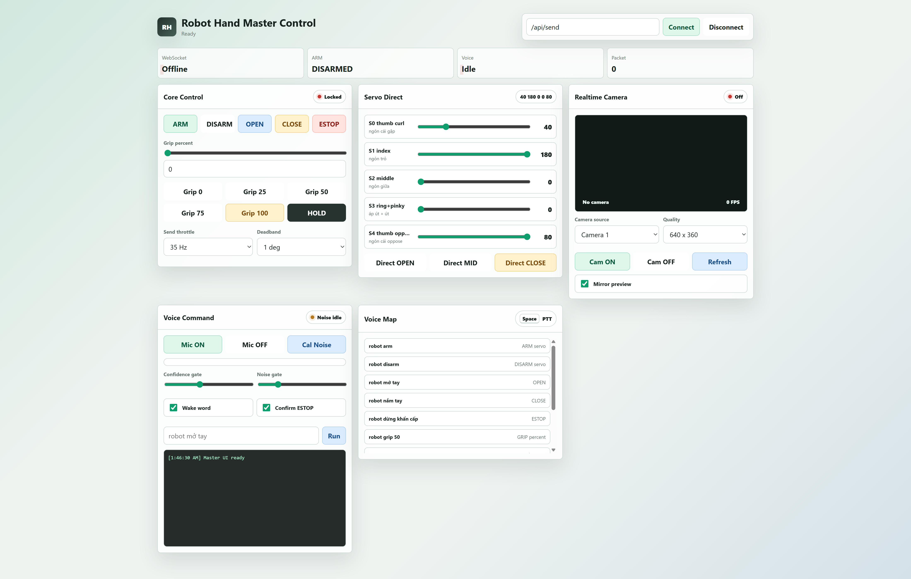

<div align="center">

# Vision-Driven Robot Hand

### Real-time AIoT robot hand control with Computer Vision, Web Dashboard, Voice Commands, ESP32, Arduino Uno, and 5-servo tendon actuation

<p>
  
  
  
  
</p>

<p>
  
  
  
  
</p>

<p>
  
</p>

<p>
  <b>Camera sees.</b>
  <b>PC interprets.</b>
  <b>ESP32 relays.</b>
  <b>Arduino executes.</b>
  <b>Robot hand moves.</b>
</p>

</div>

## Table Of Contents

- [Vietnamese](#vietnamese)
- [English](#english)
- [Project Assets](#project-assets)

---

## Vietnamese

### Giới thiệu

`Vision-Driven Robot Hand` là dự án AIoT điều khiển bàn tay robot 5 bậc tự do theo thời gian thực, trong đó chuyển động bàn tay người được thu nhận bằng camera, xử lý trên PC, đóng gói thành lệnh nhị phân, truyền qua ESP32 và thực thi trên Arduino Uno để điều khiển cụm servo thật.

Đây là một bài toán triển khai AI vào phần cứng thực tế, không dừng lại ở mức nhận diện hình ảnh. Hệ thống đi trọn chuỗi:

- Perception bằng Computer Vision
- Operator control bằng dashboard web
- Realtime communication bằng WebSocket + UART
- Embedded actuation trên ESP32 và Arduino Uno
- Safety workflow để vận hành phần cứng thật

### Điểm nổi bật

| Hạng mục | Mô tả |
| --- | --- |
| Realtime hardware control | Điều khiển servo thật, không phải mô phỏng |
| Multi-input control | Nhận lệnh từ CV, dashboard hoặc voice command |
| Layered architecture | Tách rõ CV, web, protocol, ESP32 bridge, Uno actuator |
| Safety-first workflow | Có `ARM`, `DISARM`, `ESTOP`, link test và preview an toàn |
| Embedded-friendly protocol | Binary packet 8 byte gọn, dễ kiểm tra checksum, dễ debug |
| Demo-ready | Có sẵn script cho setup, link test, preview và realtime run |

### Demo trực quan

| Poster tổng quan | Dashboard điều khiển |
| --- | --- |
|  |  |

Hai hình trên thể hiện rõ hai mặt quan trọng nhất của dự án:

- Bức tranh hệ thống tổng thể từ AI đến actuator thật
- Giao diện vận hành thực tế dùng để điều khiển, test và demo

### Tech Stack

<p>
  
</p>

Các công nghệ và thành phần chính:

- Python client cho CV, calibration và protocol test
- HTML dashboard + local Python bridge server
- ESP32 làm WebSocket bridge
- Arduino Uno điều khiển 5 servo tendon-driven
- Giao thức binary 8 byte cho realtime control

### Hệ thống làm được gì

| Thành phần | Khả năng hiện tại |
| --- | --- |
| Robot hand | `OPEN`, `CLOSE`, `GRIP`, direct servo angles, hold pose |
| Computer vision | Theo dõi hand skeleton, calibration, preview, realtime send |
| Web dashboard | Connect, ARM/DISARM, grip slider, direct servo sliders, camera preview |
| Voice control | Lệnh cơ bản như open hand, close hand, arm, disarm, estop |
| Debugging | Link test, packet test, protocol reference, hardware checklist |

### Kiến trúc tổng thể

```text
Camera / Voice / Dashboard
-> PC client hoặc browser UI
-> Binary packet 8 byte
-> ESP32 WebSocket bridge
-> UART2 TX2 GPIO17
-> Arduino Uno RX D0
-> 5-servo tendon-driven robot hand
```

### Kiến trúc theo tầng

#### 1. Computer Vision Layer

- Đọc camera và theo dõi bàn tay người
- Chuyển pose thành góc servo
- Preview an toàn trước khi gửi lệnh thật
- Gửi packet realtime khi hệ thống sẵn sàng

File chính:

- [`pc_client/cv_sender_template.py`](pc_client/cv_sender_template.py)

#### 2. Web Control Layer

- Dashboard điều khiển trực tiếp
- `ARM`, `DISARM`, `ESTOP`
- `OPEN`, `CLOSE`, `GRIP`
- Direct control từng servo
- Camera preview và browser-safe bridge

File chính:

- [`web_client/master_control.html`](web_client/master_control.html)
- [`web_client/master_control_server.py`](web_client/master_control_server.py)

#### 3. ESP32 Bridge Layer

- Tạo AP `RobotHand_ESP32`
- Host WebSocket server ở port `81`
- Kiểm tra `start byte` và `checksum`
- Forward packet sang Uno qua `Serial2`

Firmware:

- [`firmware/esp32_ws_bridge/esp32_robot_hand_ws_bridge/esp32_robot_hand_ws_bridge.ino`](firmware/esp32_ws_bridge/esp32_robot_hand_ws_bridge/esp32_robot_hand_ws_bridge.ino)

#### 4. Actuator Layer

- Nhận packet 8 byte từ ESP32
- Quản lý `DISARMED`, `ARMED`, `ESTOP`
- Thực thi `OPEN`, `CLOSE`, `GRIP`, `DIRECT`
- Điều khiển 5 servo theo calibration cố định

Firmware:

- [`firmware/arduino_uno/robot_hand_uno_realtime_final/robot_hand_uno_realtime_final.ino`](firmware/arduino_uno/robot_hand_uno_realtime_final/robot_hand_uno_realtime_final.ino)

### Phần cứng

#### Linh kiện

- 1 ESP32
- 1 Arduino Uno
- 1 MG90S
- 4 MG996R
- 1 nguồn servo riêng `5V-6V`

#### Servo mapping

```text
S0 thumb curl    -> Uno D3
S1 index         -> Uno D5
S2 middle        -> Uno D6
S3 ring+pinky    -> Uno D9
S4 thumb oppose  -> Uno D10
```

#### UART wiring

```text
ESP32 GPIO17 / TX2 -> Uno RX D0
ESP32 GND          -> Uno GND
```

Hệ thống đang dùng cấu hình truyền một chiều từ ESP32 sang Uno.

#### Quy tắc cấp nguồn servo

- Dùng nguồn servo riêng
- Không cấp cả cụm servo từ chân `5V` của Uno hoặc ESP32
- Khuyến nghị tối thiểu `6V 10A`
- Nối chung tất cả GND: servo PSU, Uno, ESP32

Tài liệu liên quan:

- [`HARDWARE_CHECKLIST.md`](HARDWARE_CHECKLIST.md)
- [`docs/wiring.md`](docs/wiring.md)

### Locked Calibration

```text
OPEN  = {40, 180, 0,   0,   80}
CLOSE = {170, 0,   180, 180, 0}
```

Đây là calibration cần phải đồng bộ giữa firmware, PC client và dashboard.

Tài liệu liên quan:

- [`docs/calibration.md`](docs/calibration.md)
- [`pc_client/hand_pose_calibration.json`](pc_client/hand_pose_calibration.json)
- [`pc_client/servo_tendon_profile.json`](pc_client/servo_tendon_profile.json)

### Khởi động nhanh

#### 1. Cài môi trường Python

```powershell
.\setup_python_env.bat
```

#### 2. Nạp firmware

- Uno: [`firmware/arduino_uno/robot_hand_uno_realtime_final/robot_hand_uno_realtime_final.ino`](firmware/arduino_uno/robot_hand_uno_realtime_final/robot_hand_uno_realtime_final.ino)
- ESP32: [`firmware/esp32_ws_bridge/esp32_robot_hand_ws_bridge/esp32_robot_hand_ws_bridge.ino`](firmware/esp32_ws_bridge/esp32_robot_hand_ws_bridge/esp32_robot_hand_ws_bridge.ino)

Nếu upload Uno lỗi sync, rút dây `ESP32 TX2 -> Uno RX D0`, upload xong cắm lại.

#### 3. Kết nối Wi-Fi ESP32

```text
SSID: RobotHand_ESP32
Pass: 12345678
IP:   192.168.4.1
WS:   ws://192.168.4.1:81
```

#### 4. Chạy link test trước

```powershell
.\run_link_test.bat
```

#### 5. Chạy mode cần dùng

```powershell
.\run_master_control.bat
.\run_preview_cv.bat
.\run_realtime_cv.bat
```

### Các chế độ vận hành

#### Master Control Dashboard

Mode đầy đủ nhất để demo và vận hành:

- Web control panel
- `ARM` / `DISARM` / `ESTOP`
- Grip presets và servo sliders
- Voice command panel
- Camera preview realtime

```powershell
.\run_master_control.bat
```

Workflow gợi ý:

```text
Connect -> ARM -> OPEN/CLOSE/GRIP -> DIRECT CONTROL
```

#### CV Preview Only

Mode an toàn để kiểm tra landmark và mapping mà không tác động lên phần cứng.

```powershell
.\run_preview_cv.bat
```

#### CV Realtime Control

Chỉ dùng sau khi link test đã pass.

```powershell
.\run_realtime_cv.bat
```

#### Link Test

```powershell
.\run_link_test.bat
```

Nó kiểm tra trực tiếp tuyến:

```text
PC -> WebSocket -> ESP32 -> UART -> Uno
```

### Giao thức truyền thông

Realtime control sử dụng packet nhị phân cố định `8 byte`.

```text
Byte 0: 0xAA
Byte 1: mode
Byte 2..6: payload
Byte 7: XOR checksum của byte 0..6
```

Modes:

```text
0x01 = direct angles
0x02 = grip percent
0x10 = ARM
0x11 = DISARM
0x12 = ESTOP
0x13 = OPEN
0x14 = CLOSE
```

Chi tiết thêm:

- [`docs/protocol.md`](docs/protocol.md)
- [`tools/make_packet_reference.py`](tools/make_packet_reference.py)

### Quy trình an toàn

1. Kiểm tra nguồn và GND chung.
2. Xác nhận wiring.
3. Chạy `link test`.
4. Mở dashboard và `ARM` khi sẵn sàng.
5. Test `OPEN`, `CLOSE`, `GRIP` trước.
6. Chỉ chạy `CV realtime` khi đường truyền đã ổn định.
7. Sử dụng `DISARM` hoặc `ESTOP` nếu có bất thường.

Trạng thái chính:

- `DISARMED`
- `ARMED`
- `ESTOP`

### Cấu trúc dự án

```text
robot_hand_realtime/
|-- firmware/
|-- pc_client/
|-- web_client/
|-- docs/
|-- scripts/
|-- tools/
|-- poster/
|-- QUICKSTART.md
|-- HANDOVER.md
|-- HARDWARE_CHECKLIST.md
|-- KNOWN_ISSUES.md
`-- README.md
```

### File quan trọng

| File | Vai trò |
| --- | --- |
| [`QUICKSTART.md`](QUICKSTART.md) | Cách chạy nhanh nhất cho người mới |
| [`HANDOVER.md`](HANDOVER.md) | Bàn giao ngắn gọn cho demo/operator |
| [`HARDWARE_CHECKLIST.md`](HARDWARE_CHECKLIST.md) | Checklist nguồn, dây, upload firmware |
| [`KNOWN_ISSUES.md`](KNOWN_ISSUES.md) | Các tình huống lỗi đã gặp |
| [`docs/protocol.md`](docs/protocol.md) | Mô tả giao thức 8 byte |
| [`docs/calibration.md`](docs/calibration.md) | Ghi chú calibration |
| [`docs/realtime_notes.md`](docs/realtime_notes.md) | Ghi chú tuning realtime |

### Verification và Release

```powershell
powershell -ExecutionPolicy Bypass -File .\scripts\verify_project.ps1
powershell -ExecutionPolicy Bypass -File .\scripts\build_release.ps1
```

### Giới hạn hiện tại

- CV phụ thuộc ánh sáng, góc tay và camera
- Cơ cấu tendon-driven cần calibration kỹ
- Độ mượt và grip force bị ảnh hưởng bởi nguồn và cơ khí
- Dashboard browser hiện vẫn phụ thuộc Python bridge để giao tiếp ổn định với ESP32

### Kết luận ngắn

Dự án này thể hiện rõ một pipeline AIoT hoàn chỉnh: từ perception, protocol, control đến actuator thật. Đây là một portfolio project rất mạnh cho AI ứng dụng, robotics và embedded integration.

---

## English

### Overview

`Vision-Driven Robot Hand` is a real-time AIoT project that maps human hand motion to a physical 5-servo robot hand. Camera input is processed on the PC, converted into compact binary control packets, transmitted through ESP32, and executed by Arduino Uno on real hardware.

This is not just a vision demo. It is an end-to-end deployment pipeline covering:

- Computer vision perception
- Operator control through a web dashboard
- Realtime communication with WebSocket and UART
- Embedded actuation with ESP32 and Arduino Uno
- Safety workflow for real hardware operation

### Highlights

| Item | Description |
| --- | --- |
| Real hardware control | Drives actual servos instead of stopping at simulation |
| Multi-input control | Supports CV, dashboard, and voice-command based control |
| Layered architecture | CV, web UI, protocol, ESP32 bridge, and Uno actuator are separated cleanly |
| Safety-first design | Includes `ARM`, `DISARM`, `ESTOP`, link test, and safe preview mode |
| Embedded-friendly protocol | Uses a compact fixed 8-byte binary packet |
| Demo-ready workflow | Includes scripts for setup, testing, preview, and realtime operation |

### Visual Preview

| System Poster | Control Dashboard |
| --- | --- |
|  |  |

These two visuals quickly communicate the project's value:

- a complete AI-to-hardware control story
- a practical operator-facing dashboard for real demonstrations

### System Capability

| Component | Current capability |
| --- | --- |
| Robot hand | `OPEN`, `CLOSE`, `GRIP`, direct servo control, hold pose |
| Computer vision | Hand skeleton tracking, calibration, preview, realtime sending |
| Web dashboard | Connect, ARM/DISARM, grip slider, direct servo sliders, camera preview |
| Voice control | Basic commands such as open hand, close hand, arm, disarm, estop |
| Debugging | Link test, packet test, protocol reference, hardware checklist |

### Full Pipeline

```text
Camera / Voice / Dashboard
-> PC client or browser UI
-> 8-byte binary packet
-> ESP32 WebSocket bridge
-> UART2 TX2 GPIO17
-> Arduino Uno RX D0
-> 5-servo tendon-driven robot hand
```

### Layered Architecture

#### 1. Computer Vision Layer

- Reads camera input
- Tracks the human hand
- Maps pose to servo angles
- Supports safe preview before sending live commands
- Streams realtime packets when the system is ready

Main file:

- [`pc_client/cv_sender_template.py`](pc_client/cv_sender_template.py)

#### 2. Web Control Layer

- Direct operator dashboard
- `ARM`, `DISARM`, `ESTOP`
- `OPEN`, `CLOSE`, `GRIP`
- Per-servo slider control
- Local bridge for browser-safe communication to ESP32

Main files:

- [`web_client/master_control.html`](web_client/master_control.html)
- [`web_client/master_control_server.py`](web_client/master_control_server.py)

#### 3. ESP32 Bridge Layer

- Creates the `RobotHand_ESP32` access point
- Hosts the WebSocket server on port `81`
- Verifies `start byte` and `checksum`
- Forwards packets to Uno over `Serial2`

Firmware:

- [`firmware/esp32_ws_bridge/esp32_robot_hand_ws_bridge/esp32_robot_hand_ws_bridge.ino`](firmware/esp32_ws_bridge/esp32_robot_hand_ws_bridge/esp32_robot_hand_ws_bridge.ino)

#### 4. Actuator Layer

- Receives 8-byte packets from ESP32
- Manages `DISARMED`, `ARMED`, and `ESTOP`
- Executes `OPEN`, `CLOSE`, `GRIP`, and `DIRECT`
- Drives the 5-servo hand using fixed calibration

Firmware:

- [`firmware/arduino_uno/robot_hand_uno_realtime_final/robot_hand_uno_realtime_final.ino`](firmware/arduino_uno/robot_hand_uno_realtime_final/robot_hand_uno_realtime_final.ino)

### Hardware

#### Components

- 1 ESP32
- 1 Arduino Uno
- 1 MG90S
- 4 MG996R
- 1 dedicated `5V-6V` servo power supply

#### Servo Mapping

```text
S0 thumb curl    -> Uno D3
S1 index         -> Uno D5
S2 middle        -> Uno D6
S3 ring+pinky    -> Uno D9
S4 thumb oppose  -> Uno D10
```

#### UART Wiring

```text
ESP32 GPIO17 / TX2 -> Uno RX D0
ESP32 GND          -> Uno GND
```

The current design uses one-way communication from ESP32 to Uno.

#### Servo Power Rules

- Use a dedicated servo power supply
- Do not power the full servo cluster from Uno or ESP32 `5V`
- Recommended minimum: `6V 10A`
- Share common ground across servo PSU, Uno, and ESP32

Related docs:

- [`HARDWARE_CHECKLIST.md`](HARDWARE_CHECKLIST.md)
- [`docs/wiring.md`](docs/wiring.md)

### Locked Calibration

```text
OPEN  = {40, 180, 0,   0,   80}
CLOSE = {170, 0,   180, 180, 0}
```

This calibration must stay synchronized across firmware, PC client, and dashboard.

Related files:

- [`docs/calibration.md`](docs/calibration.md)
- [`pc_client/hand_pose_calibration.json`](pc_client/hand_pose_calibration.json)
- [`pc_client/servo_tendon_profile.json`](pc_client/servo_tendon_profile.json)

### Quick Start

#### 1. Set up Python environment

```powershell
.\setup_python_env.bat
```

#### 2. Flash firmware

- Uno: [`firmware/arduino_uno/robot_hand_uno_realtime_final/robot_hand_uno_realtime_final.ino`](firmware/arduino_uno/robot_hand_uno_realtime_final/robot_hand_uno_realtime_final.ino)
- ESP32: [`firmware/esp32_ws_bridge/esp32_robot_hand_ws_bridge/esp32_robot_hand_ws_bridge.ino`](firmware/esp32_ws_bridge/esp32_robot_hand_ws_bridge/esp32_robot_hand_ws_bridge.ino)

If Uno upload fails with a sync error, disconnect `ESP32 TX2 -> Uno RX D0`, upload again, then reconnect it.

#### 3. Connect to ESP32 Wi-Fi

```text
SSID: RobotHand_ESP32
Pass: 12345678
IP:   192.168.4.1
WS:   ws://192.168.4.1:81
```

#### 4. Run the link test first

```powershell
.\run_link_test.bat
```

#### 5. Run the required mode

```powershell
.\run_master_control.bat
.\run_preview_cv.bat
.\run_realtime_cv.bat
```

### Operating Modes

#### Master Control Dashboard

The most complete operator mode for demo and live control.

- Web control panel
- `ARM` / `DISARM` / `ESTOP`
- Grip presets and direct servo sliders
- Voice command panel
- Local camera preview

```powershell
.\run_master_control.bat
```

Suggested flow:

```text
Connect -> ARM -> OPEN/CLOSE/GRIP -> DIRECT CONTROL
```

#### CV Preview Only

Safe mode for checking landmark quality and mapping without moving the hardware.

```powershell
.\run_preview_cv.bat
```

#### CV Realtime Control

Use only after the link test passes.

```powershell
.\run_realtime_cv.bat
```

#### Link Test

```powershell
.\run_link_test.bat
```

This validates the direct control path:

```text
PC -> WebSocket -> ESP32 -> UART -> Uno
```

### Communication Protocol

Realtime control uses a fixed `8-byte` binary packet.

```text
Byte 0: 0xAA
Byte 1: mode
Byte 2..6: payload
Byte 7: XOR checksum of bytes 0..6
```

Modes:

```text
0x01 = direct angles
0x02 = grip percent
0x10 = ARM
0x11 = DISARM
0x12 = ESTOP
0x13 = OPEN
0x14 = CLOSE
```

More details:

- [`docs/protocol.md`](docs/protocol.md)
- [`tools/make_packet_reference.py`](tools/make_packet_reference.py)

### Safety Workflow

1. Check power and common ground.
2. Confirm wiring.
3. Run the `link test`.
4. Open the dashboard and `ARM` only when ready.
5. Test `OPEN`, `CLOSE`, and `GRIP` first.
6. Run `CV realtime` only after the transport path is stable.
7. Use `DISARM` or `ESTOP` for any abnormal motion.

Main states:

- `DISARMED`
- `ARMED`
- `ESTOP`

### Project Structure

```text
robot_hand_realtime/
|-- firmware/
|-- pc_client/
|-- web_client/
|-- docs/
|-- scripts/
|-- tools/
|-- poster/
|-- QUICKSTART.md
|-- HANDOVER.md
|-- HARDWARE_CHECKLIST.md
|-- KNOWN_ISSUES.md
`-- README.md
```

### Important Files

| File | Purpose |
| --- | --- |
| [`QUICKSTART.md`](QUICKSTART.md) | Fastest setup path for new users |
| [`HANDOVER.md`](HANDOVER.md) | Short handover guide for demo or operator transfer |
| [`HARDWARE_CHECKLIST.md`](HARDWARE_CHECKLIST.md) | Power, wiring, and firmware upload checklist |
| [`KNOWN_ISSUES.md`](KNOWN_ISSUES.md) | Known real-world failure cases and notes |
| [`docs/protocol.md`](docs/protocol.md) | 8-byte protocol description |
| [`docs/calibration.md`](docs/calibration.md) | Calibration notes |
| [`docs/realtime_notes.md`](docs/realtime_notes.md) | Realtime tuning notes |

### Verification And Release

```powershell
powershell -ExecutionPolicy Bypass -File .\scripts\verify_project.ps1
powershell -ExecutionPolicy Bypass -File .\scripts\build_release.ps1
```

### Current Limitations

- CV still depends on lighting, hand orientation, and camera quality
- Tendon-driven mechanics require careful calibration
- Motion smoothness and grip force depend heavily on power delivery and mechanics
- The browser dashboard still depends on a local Python bridge for reliable ESP32 communication

### Short Conclusion

This project shows a complete AIoT deployment chain from perception to protocol to real-world actuation. It is a strong portfolio piece for applied AI, robotics integration, and embedded control workflows.

---

## Project Assets

- Main README: [`README.md`](README.md)
- Showcase version: [`README_SHOWCASE.md`](README_SHOWCASE.md)
- Quick start: [`QUICKSTART.md`](QUICKSTART.md)
- Handover notes: [`HANDOVER.md`](HANDOVER.md)
- Hardware checklist: [`HARDWARE_CHECKLIST.md`](HARDWARE_CHECKLIST.md)
- Known issues: [`KNOWN_ISSUES.md`](KNOWN_ISSUES.md)
- Poster image: [`poster/robot_hand_poster_khung_final.png`](poster/robot_hand_poster_khung_final.png)
- Dashboard screenshot: [`poster/dashboard_capture_hd.png`](poster/dashboard_capture_hd.png)


## License

No official license has been added yet.
