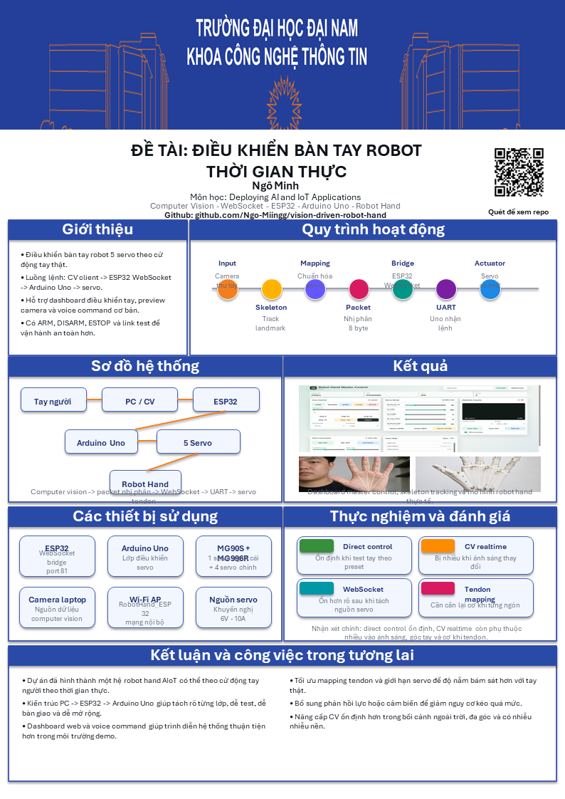

# VISION-DRIVEN ROBOT HAND

> A realtime AIoT robot-hand system where human hand motion is transformed into live motion on a physical tendon-driven robotic hand.



## Project Statement

This project is built around a simple but powerful idea:

**A camera sees a human hand. An AI-assisted control pipeline interprets that motion. A physical robot hand mirrors it in realtime.**

That means this repository is not just about vision, and not just about embedded code.

It is about connecting:

- perception
- calibration
- communication
- safety
- actuation

into one working hardware system.

## Why It Feels Strong As A Project

Many AI projects stop at detection.

Many embedded projects stop at manual control.

This one pushes through both boundaries:

- It reads real visual input from camera.
- It maps pose to robot motion.
- It streams compact binary control packets.
- It bridges high-level control to low-level actuation.
- It moves a real tendon-driven hand, not a simulation.

## The Core Experience

```text
Your hand moves
-> the camera captures it
-> the PC interprets it
-> the ESP32 relays it
-> the Arduino executes it
-> the robot hand responds
```

That direct cause-and-effect is the heart of the demo.

## Live Control Pipeline

```text
Camera / Voice / Dashboard
-> PC client or browser UI
-> Binary packet (8 bytes)
-> ESP32 WebSocket bridge
-> UART2 TX2 GPIO17
-> Arduino Uno RX D0
-> 5-servo tendon-driven robot hand
```

## What The System Can Do

| Area | Capability |
| --- | --- |
| Hand control | Open, close, grip percentage, direct servo commands |
| Vision pipeline | Hand tracking, preview, calibration, realtime send |
| Operator control | Dashboard for connect, arm, disarm, estop, and manual control |
| Voice control | Basic command phrases for core actions |
| Communication | WebSocket to ESP32, UART to Uno, binary packet protocol |
| Testing | Link test and staged verification before live motion |

## Engineering Character

This repository has a strong engineering identity because it respects the realities of hardware:

- signals can fail
- power can sag
- calibration can drift
- browsers are not always safe transport layers
- servos are physical devices, not clean digital abstractions

That is why the system includes:

- `ARM`
- `DISARM`
- `ESTOP`
- dry-run and preview workflows
- link-first debugging
- fixed calibration references

## Layered Architecture

### CV Layer

The PC-side client handles camera input, pose interpretation, preview, and realtime packet emission.

Main file:

- [`pc_client/cv_sender_template.py`](pc_client/cv_sender_template.py)

### Dashboard Layer

The dashboard is the operator-facing control surface for safe manual interaction and demo flow.

Main files:

- [`web_client/master_control.html`](web_client/master_control.html)
- [`web_client/master_control_server.py`](web_client/master_control_server.py)

### ESP32 Bridge Layer

ESP32 acts as the wireless bridge between high-level control and low-level serial transport.

Firmware:

- [`firmware/esp32_ws_bridge/esp32_robot_hand_ws_bridge/esp32_robot_hand_ws_bridge.ino`](firmware/esp32_ws_bridge/esp32_robot_hand_ws_bridge/esp32_robot_hand_ws_bridge.ino)

### Arduino Actuator Layer

Arduino Uno is the final actuator controller. It receives the packet and turns it into actual servo motion.

Firmware:

- [`firmware/arduino_uno/robot_hand_uno_realtime_final/robot_hand_uno_realtime_final.ino`](firmware/arduino_uno/robot_hand_uno_realtime_final/robot_hand_uno_realtime_final.ino)

## Hardware Identity

This robot hand uses:

- 1 ESP32
- 1 Arduino Uno
- 1 MG90S
- 4 MG996R
- a dedicated high-current servo power supply

Servo mapping:

```text
S0 thumb curl    -> Uno D3
S1 index         -> Uno D5
S2 middle        -> Uno D6
S3 ring+pinky    -> Uno D9
S4 thumb oppose  -> Uno D10
```

UART wiring:

```text
ESP32 GPIO17 / TX2 -> Uno RX D0
ESP32 GND          -> Uno GND
```

Recommended power rule:

```text
Use a dedicated 5V-6V servo PSU
Recommended minimum: 6V 10A
All grounds must be shared
```

## Locked Calibration

These values define the hand's hard reference points and should stay synchronized across all control layers:

```text
OPEN  = {40, 180, 0,   0,   80}
CLOSE = {170, 0,   180, 180, 0}
```

## Binary Protocol

The control path is intentionally compact.

```text
Byte 0: 0xAA
Byte 1: mode
Byte 2..6: payload
Byte 7: XOR checksum
```

Modes:

```text
0x01 = direct angles
0x02 = grip percent
0x10 = ARM
0x11 = DISARM
0x12 = ESTOP
0x13 = OPEN
0x14 = CLOSE
```

This matters because realtime actuator control benefits from predictable payload size and minimal parsing cost.

## Safe Demo Sequence

If you want the best live presentation flow, use this order:

1. Show the hardware and explain the power rule.
2. Show the communication pipeline.
3. Run the link test.
4. Open the dashboard and demonstrate direct servo control.
5. Show CV preview mode.
6. Run realtime hand mirroring.
7. Finish with voice commands or grip presets.

## Quick Launch

```powershell
.\setup_python_env.bat
.\run_link_test.bat
.\run_master_control.bat
.\run_preview_cv.bat
.\run_realtime_cv.bat
```

## Important Supporting Docs

- [`README.md`](README.md)
- [`QUICKSTART.md`](QUICKSTART.md)
- [`HANDOVER.md`](HANDOVER.md)
- [`HARDWARE_CHECKLIST.md`](HARDWARE_CHECKLIST.md)
- [`KNOWN_ISSUES.md`](KNOWN_ISSUES.md)
- [`docs/protocol.md`](docs/protocol.md)
- [`docs/calibration.md`](docs/calibration.md)
- [`docs/realtime_notes.md`](docs/realtime_notes.md)

## Final Impression

`Vision-Driven Robot Hand` stands out because it brings AI, robotics, embedded systems, and operator tooling into a single working realtime artifact.

It is a project that looks impressive in a portfolio, but more importantly, it demonstrates genuine systems integration discipline.
